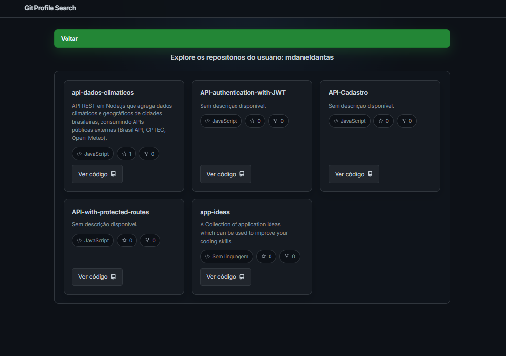

# Git Profile Search

GitHub Finder é uma aplicação web que permite aos usuários buscar perfis do GitHub e visualizar informações detalhadas sobre os usuários e seus repositórios.

- **Veja Online:** https://gitprofilesearch.vercel.app





## Funcionalidades

- 🔍 Busca de perfis de usuários do GitHub
- 📊 Exibição de informações principais do usuário (como seguidores, seguindo, localização)
- 📚 Listagem dos repositórios mais relevantes do usuário
- 🖥️ Interface amigável e responsiva

## Tecnologias Utilizadas

- React
- Vite
- TypeScript
- React Router DOM
- CSS Modules
- GitHub API

## Como Executar o Projeto

1. Clone o repositório:

    ```terminal
    git clone https://github.com/mdanieldantas/github-finder.git
    cd github-finder
    ```

2. Instale as dependências:

    ```terminal
    npm install
    ```

3. Execute o projeto:

    ```terminal
    npm rum dev
    ```

4. Abra http://localhost:3000 no seu navegador para ver a aplicação em execução.

## Aprendizados

Este projeto foi uma excelente oportunidade para:

- 🔷 Aprofundar conhecimentos em TypeScript
- 🔷 Praticar commits semânticos e organizados
- 🔷 Consumir e integrar com a API do GitHub
- 🔷 Implementar boas práticas de código limpo e estruturação de projeto

## Contribuições

Contribuições são bem-vindas! Sinta-se à vontade para abrir uma issue ou enviar um pull request.

## Licença

Este projeto está sob a licença MIT. Veja o arquivo LICENSE para mais detalhes.

## Contato

**M. Daniel Dantas**

- **Linkedin:** https://www.linkedin.com/in/mdanieldantas
- **Email:** contatomarcosdgomes@gmail.com
- **Link do Projeto:** https://github.com/mdanieldantas/API-Cadastro.git
